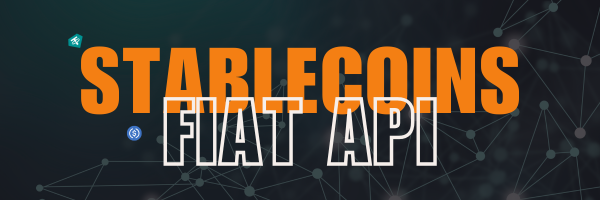

# API DOCUMENTATION
This documentation provides a guide on how to integrate with Pretium's open APIs.

## To Get Started
Reach out our tech team `hello@pretium.africa` for provision of `base_uri`, `x-api-key` and `settlement wallet address`

### Authorization Required
All endpoints require API key authorization. Ensure that you include the `x-api-key` header in every request.

### Exchange Rates
This endpoint retrieves exchange rates and can be used to calculate fiat equivalent for a given stablecoin amount. <br><br>
`POST {{uri}}/v1/exchange-rate`

#### Body Params
```javascript
{
    "currency_code": "KES"
}
```

### Validation
This endpoint is used to validate a merchant code, mobile number, or bank account number. In response, you get the corresponding business name, registered individual name (as provided by MNOs), or bank account details.<br><br>
`POST {{uri}}/v1/validation`

| Params | Countries | Required |
| --- | --- | --- |
| type | KES | Yes |
| shortcode | KES, UGX & GHS | Yes |
| mobile_network | KES, UGX & GHS | Yes |
| account_number | NGN | Yes |
| bank_code | NGN | Yes |

##### Sample
```javascript
{
    "type": "MOBILE",
    "shortcode": "0799770833",
    "mobile_network": "Safaricom"
}
```

- Mobile networks: `Safaricom`, `Airtel`, `MTN`, `AirtelTigo`, & `Telcel`
- Type: `PAYBILL`, `BUY_GOODS` & `MOBILE`

<br>

**Note: When validating markets other than Kenya, include the currency code in the `uri`, for example: `{{uri}}/v1/validation/UGX`**

### Pay
This endpoint calls the Pretium payment protocol to verify that the payment has been made to the settlement wallet and release the equivalent fiat.    

`POST {{uri}}/v1/pay`
| Params | Countries | Required |
| --- | --- | --- |
| transaction_hash | All | Yes |
| amount | All | Yes |
| shortcode | KES, UGX & GHS | Yes |
| account_number | KES & NGN | Yes |
| type | KES | Yes |
| mobile_network | KES, UGX & GHS | Yes |
| account_name | NGN | Yes |
| bank_name | NGN | Yes |
| bank_code | NGN | Yes |
| callback_url | All | No |
| chain | All | No |

- Chain: `CELO`, `BASE` or `STELLAR`

##### Sample
```javascript
{
    "transaction_hash":"0x55a572efe1720250e442f38741477a4fc3f7f152e5cd208cc52f8222a1c2a13b",
    "shortcode": "0799770833",
    "amount": "500",
    "type": "MOBILE",
    "callback_url": "https://pretium.africa/callback"
}
```


**Note 1: When calling this API on other markets apart from Kenya, include the currency code in the `uri`, for example: `{{uri}}/v1/pay/UGX`** <br> <br>
**Note 2: Account number in `KES` is required only when `type` is `PAYBILL`**

### Banks
This endpoint is used to get list of banks supported in `NGN` market.    

`POST {{uri}}/v1/banks`

### Status
`POST {{uri}}/v1/status`

#### Body Params
```javascript
{
    "transaction_code": "09eb23f8-6a11-4fec-b6bc-168ccf4e254d"
}
```

**Note: When calling this API on other markets than Kenya, include the currency code in the `uri`, for example: `{{uri}}/v1/status/UGX`**

### Supported Blockchain Networks
- Celo
- Base
- Stellar

